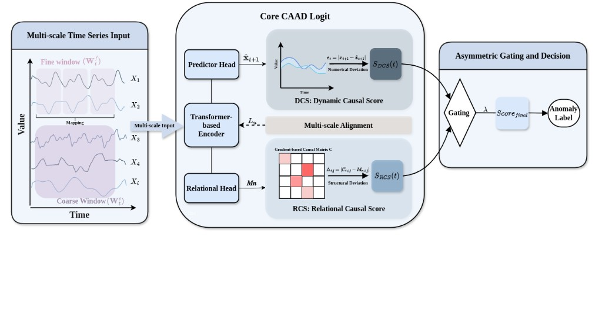

# CAAD: Causality-Aware Multivariate Time Series Anomaly
Detection via Multi-Scale Alignment and Structural Causal
Consistency

## Abstract

The operational integrity of complex industrial systems relies on precise anomaly detection and diagnosis. The vast majority of existing methods narrowly focus on capturing temporal similarities of representations, often overlooking the disruption of internal causal relationships, which characterizes system failures and latent anomalies. In this paper, we propose a novel framework (CAAD) that reframes anomaly detection as the continuous verification of Granger causality consistency through exogenous variables. Specifically, the CAAD framework models exogenous time-series variables as residuals, identifying anomalies as significant deviations caused by external interventions. The proposed framework leverages multi-scale alignment to internalize system dynamics and utilizes a gradient-based matrix to monitor internal causal relationship breakdowns. By quantifying causal deviations of both dynamic evolution and relational topology, the CAAD is able to capture subtle causal shifts to achieve precise anomaly detection. Extensive experiments on real-world industrial datasets demonstrate that the CAAD achieves high-precision anomaly detection, outperforming most state-of-the-art baselines.

## Framework



## Features

- **CAAD framework**: Causal deviation tracking with gradient-based causal matrices
- **Multi-scale alignment**: Joint modeling of fine/coarse dynamics
- **Temporal deviation**: MAD-normalized residual scoring with top-k aggregation
- **Causal fusion**: Structural and temporal scores with configurable fusion

## Project Structure

```
├── model/              # Core model and causal scoring logic
├── utils/              # Shared utilities (I/O, causal eval, sequence tools)
├── experiments/        # Dataset-specific utilities and side branches
├── data/processing/    # Dataset processing scripts
├── scripts/            # Main training and evaluation entrypoints
└── data/               # Raw and processed datasets (gitignored)
```

## Quick Start

1. Install dependencies:
```bash
pip install -r requirements.txt
```

2. Prepare data:
   - Place raw data files under `data/`
   - Run processing scripts in `data/processing/` to generate `.pt` bundles

3. Run experiments:

### Stage-1 training:
```bash
python scripts/train_stage1.py \
  --data_dir data/SWaT/processed \
  --coarse_file swat_coarse.pt \
  --fine_file swat_fine.pt \
  --model_save_path models/swat_stage1.pt
```

### Causal stability evaluation:
```bash
python scripts/verify_causal_stability.py \
  --model_path models/swat_stage1.pt \
  --data_dir data/SWaT/processed \
  --data_file data/SWaT/processed/swat_fine.pt \
  --scale fine \
  --global_threshold_percentile 10
```

### Fusion sweep:
```bash
python scripts/sweep_causal_fusion.py \
  --model_path models/swat_stage1.pt \
  --data_dir data/SWaT/processed \
  --data_file data/SWaT/processed/swat_fine.pt \
  --scale fine \
  --global_threshold_percentile 10 \
  --fusion_normalize --struct_metric relative \
  --fusion_mode relu_gate \
  --sweep_relu \
  --relu_tau_percentile 90 \
  --lambda_start 0 --lambda_end 1 --lambda_step 0.1 \
  --save_dir analysis
```

## Data & Models

- **Data files** are not included due to size constraints. Place raw data under `data/` and generate `.pt` bundles with `data/processing/`.
- **Trained models** are not included. Train models using the provided scripts.
- **Processed data** (`.pt`) are excluded from git and should be generated locally.

## Citation

If you use this code, please cite our work.

